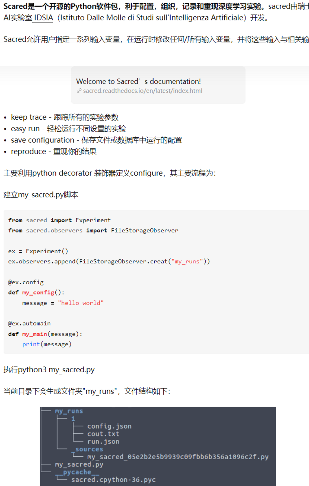
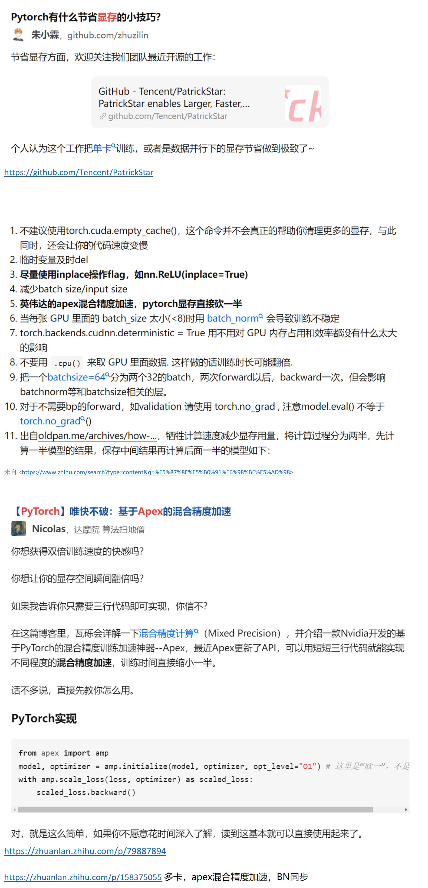
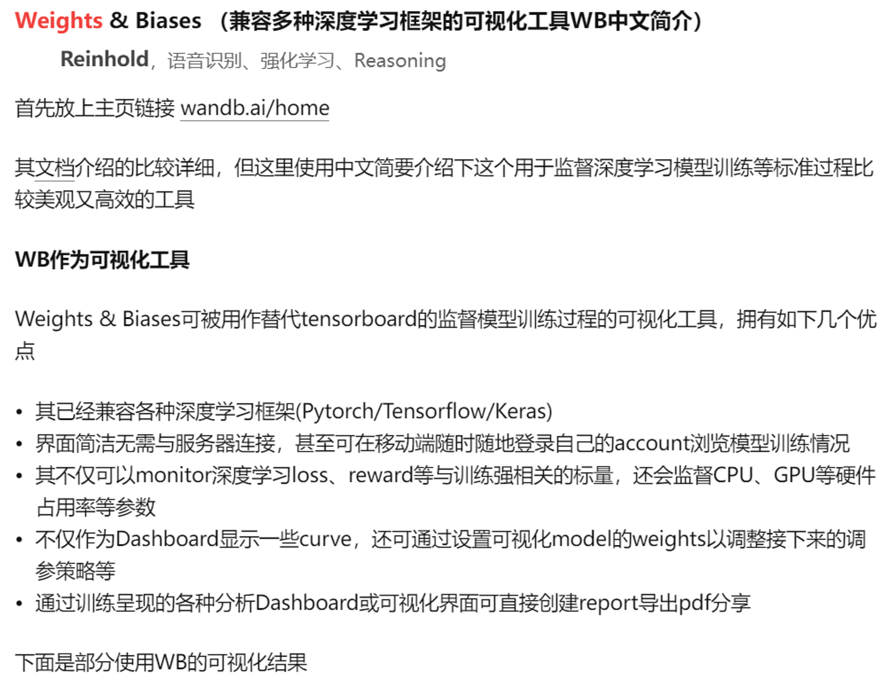
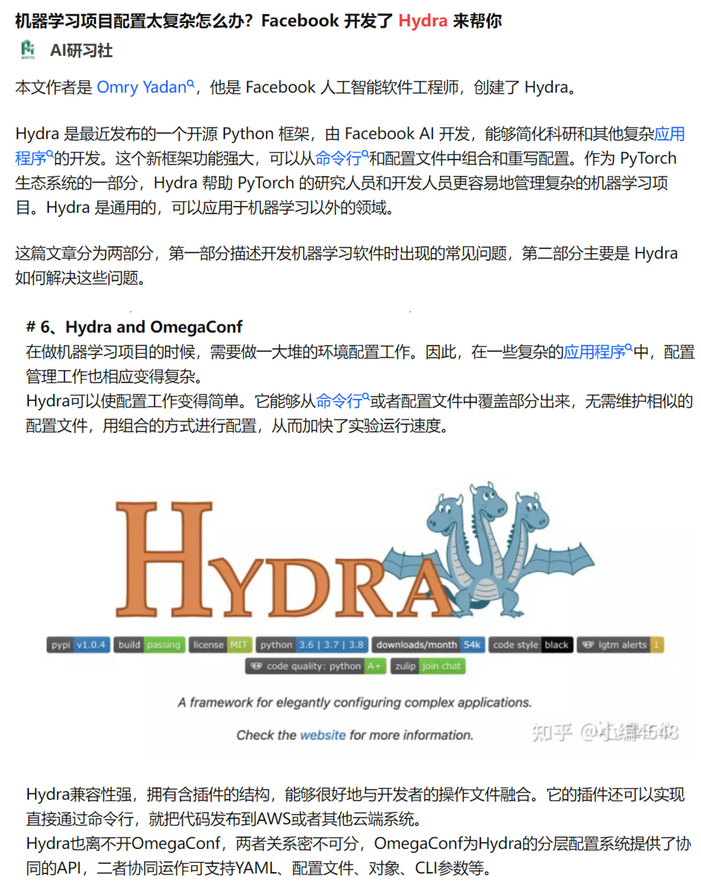
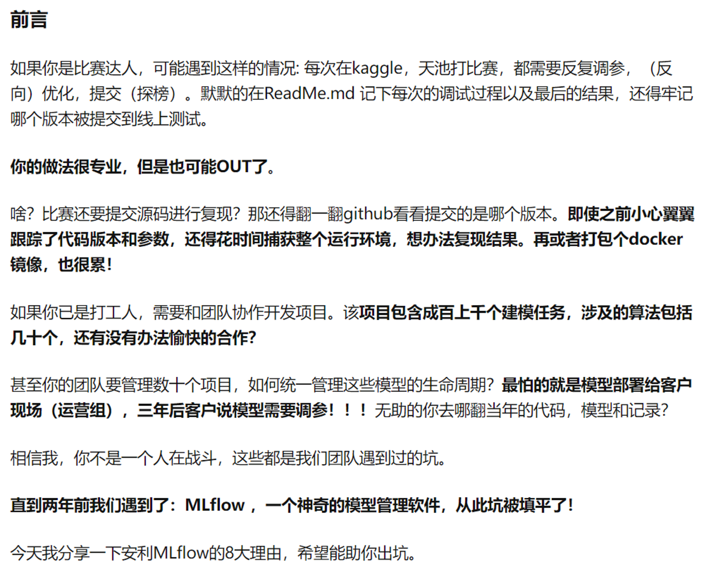

# Gradient Accumulation

# Training in Multi-GPUs

# Py-Spy
Pyspy [https://github.com/benfred/py-spy](https://github.com/benfred/py-spy)
# Loguru
[https://github.com/Delgan/loguru](https://github.com/Delgan/loguru)
# Github1s
[https://greasyfork.org/zh-CN/scripts/421631-%E6%98%BE%E7%A4%BA-github1s-%E6%8C%89%E9%92%AE](https://greasyfork.org/zh-CN/scripts/421631-%E6%98%BE%E7%A4%BA-github1s-%E6%8C%89%E9%92%AE)

看GitHub代码工具
# Sacred

# Omniboard
查看sacred保存的log和configuration

来自 <[https://www.zhihu.com/search?type=content&q=omniboard](https://www.zhihu.com/search?type=content&q=omniboard)>
# Reduce Memory & Accelerate

# Weights&Bias

# Hydra、OmegaConf

# MLflow
